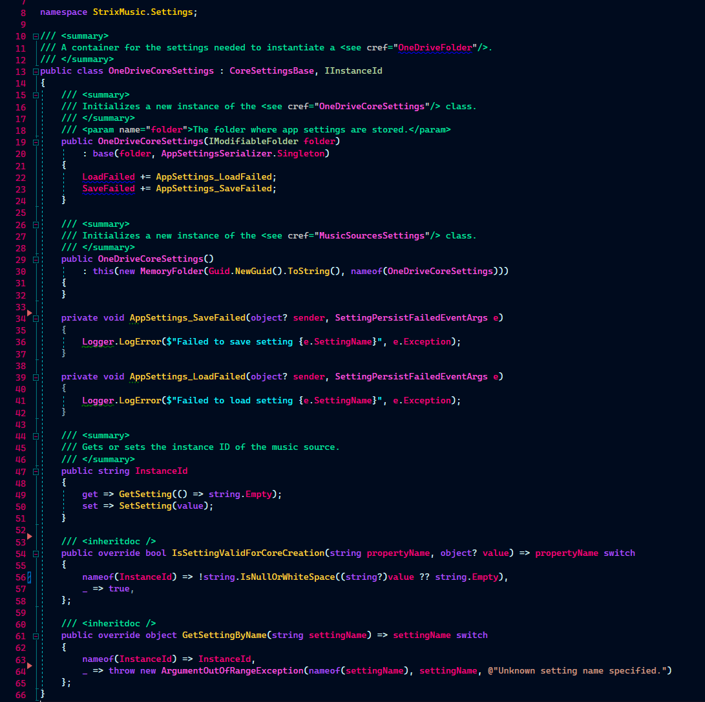
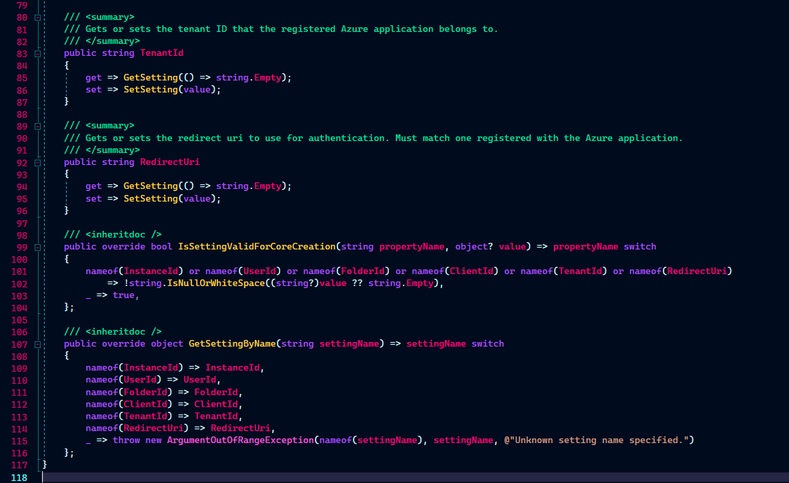
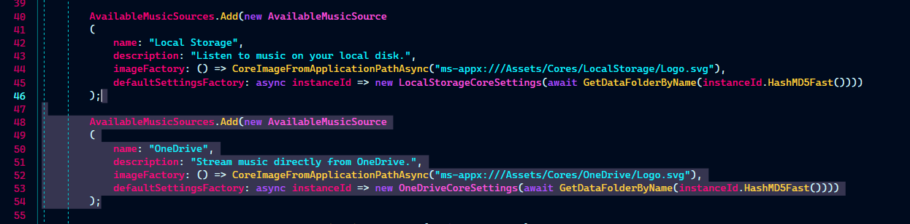
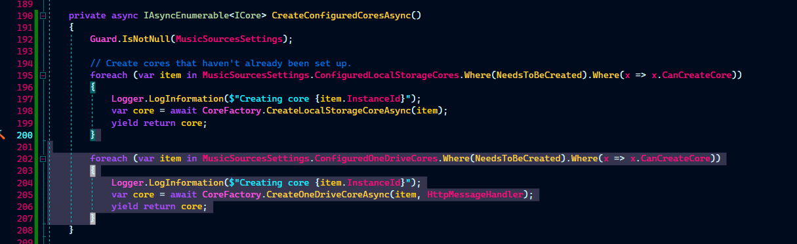

# Add a new music source
This guide will help you add a new music source to the Strix Music App.

In the app, this is all handled in the `StrixMusic.Shared` project.

> [!NOTE]
> 1. If you do not have a core that is ready to use, see [Create a core](../cores/create.md) first. 
> 2. We created this guide by documenting how we added OneDrive as a music source. Substitute any OneDrive-specific code with your own.

You'll need to:
- Create the settings class for your core
- Create your CoreFactory
- Register as an available music source
- Tell AppRoot how to turn settings into core instances
- Create and link the first time setup UI for your core
- Create and link the "Options" control for your core.

## Create your core settings
Settings are used to store the data that's required to construct a core. We'll be turning a settings class into an `ICore` instance, so this up.

### Initial setup

To speed up setup of serialization and storage, duplicate an existing settings file instead of creating a new one.

1. Duplicate and rename an existing settings class (anything that inherits from `CoreSettingsBase`). 
2. Perform a replace-all on it, trading the existing class name for your own.
3. Remove all properties except for `InstanceId`
4. In `IsSettingValidForCoreCreation` and `GetSettingByName`, remove handling of any removed properties.
5. Update all existing comments to reflect your new class.

You should now have a settings class with all the plumbing and requirements set up.

Here, we've copied `LocalStorageCoreSettings.cs` and created `OneDriveCoreSettings.cs`:


### Add your settings

1. Create a public property
2. In the getter, use `GetSetting(() => ...);`, replacing `...` with the fallback value to use when unset.
3. In the setter, add `SetSetting(value);`.
4. Add code comments explaining what this setting is or what it's for.
5. If the property is required for core creation, add validation in `IsSettingValidForCoreCreation` and handle the property in `GetSettingByName`.
6. Add the property's type to `AppSettingsSerializerContext` if needed.

Here, we've added what we need to create a OneDrive folder that we can give to `StorageCore`:


## Create your CoreFactory
In the Shared project, open `CoreFactory.cs` and create a new static method using the same convention as the others in the file.

Use this method to specify how to turn a settings instance into an instance of `ICore`.

If `settings.CanCreateCore` is false, this method will never even get called. This method should _only_ turn a fully valid settings instance into `ICore`. Setup and validation of those values will happen elsewhere.

## Register as an available music source

In the constructor for `StrixMusic.Settings.MusicSourceSettings`, add a new `AvailableMusicSource` to `AvailableMusicSources`, like so:



Then, add an `ObservableCollection<T>`, where `<T>` is the settings class you created for this core. This will be the "source of truth" for which cores are registered and can be created.

For our example, we're changing:
```cs
    /// <summary>
    /// Gets the list of all registered storage cores that interact with files on disk.
    /// </summary>
    public ObservableCollection<LocalStorageCoreSettings> ConfiguredLocalStorageCores => GetSetting(defaultValue: () => new ObservableCollection<LocalStorageCoreSettings>());
```

To:
```cs
    /// <summary>
    /// Gets the list of all registered storage cores that interact with files on disk.
    /// </summary>
    public ObservableCollection<LocalStorageCoreSettings> ConfiguredLocalStorageCores => GetSetting(defaultValue: () => new ObservableCollection<LocalStorageCoreSettings>());

    /// <summary>
    /// Gets the list of all registered storage cores that interact with OneDrive.
    /// </summary>
    public ObservableCollection<OneDriveCoreSettings> ConfiguredOneDriveCores => GetSetting(defaultValue: () => new ObservableCollection<OneDriveCoreSettings>());

```

## Tell AppRoot how to turn settings into core instances
In `StrixMusic.AppModels.AppRoot.CreateConfiguredCores`, turn your configured settings instances into `ICore`, like we did for the highlighted portion:


Scroll down and subscribe to the `ObservableCollection` you created in `MusicSourcesSettings`, telling the `AppRoot` how to turn new Settings into an instance of `ICore` after the app has loaded.

For our example, we've added the highlighted portion:


## Create and link first time setup UI
Open the solution explorer. In the shared project, create a new folder in `Controls/Settings/MusicSources/ConnectNew/`, then create a new `Page`.

This new page will be navigated to when the user has requested to create a core instance. You'll be provided with a parameter of type `ConnectNewMusicSourceNavigationParams`.

You'll need this parameter to complete or cancel setup, to reference the selected `AvailableMusicSource`, and to construct a default settings instance, like so:

```cs
    /// <inheritdoc />
    override protected async void OnNavigatedTo(NavigationEventArgs e)
    {
        var param = (ConnectNewMusicSourceNavigationParams)e.Parameter;
        Guard.IsNotNull(param.SelectedSourceToConnect);
        
        // Save in a field to access from another method
        _param = param;

        // Get an instance ID and create a new settings instance with default values
        var instanceId = ...;
        var defaultSettings = await param.SelectedSourceToConnect.DefaultSettingsFactory(instanceId);  
        var settings = (OneDriveCoreSettings)defaultSettings;

        // Assign settings values needed to create a core
        TODO;

        // To show that the user canceled setup:
        // param.Item1.SetupCompleteTaskCompletionSource.SetCanceled();

        // To show that the user completed setup:
        // param.Item1.SetupCompleteTaskCompletionSource.SetResult(null);

        // To navigate to a different page.
        // Remember to pass the original ConnectNewMusicSourceNavigationParams as well, so you can complete/cancel setup from another page.
        // Frame.Navigate(typeof(NextPageType), nextPageParam));
    }
```

In `StrixMusic.Controls.Settings.MusicSources.ConnectNew.ConnectNewMusicSource.SelectMusicSource`, redirect the provided `AvailableMusicSource` to this page:

For our example, we're adding the highlighted line:


## Create and link the "Options" control
TODO
