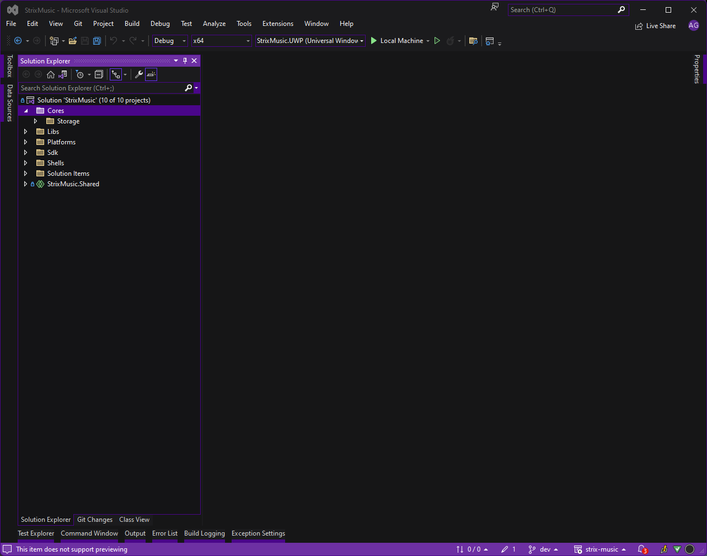
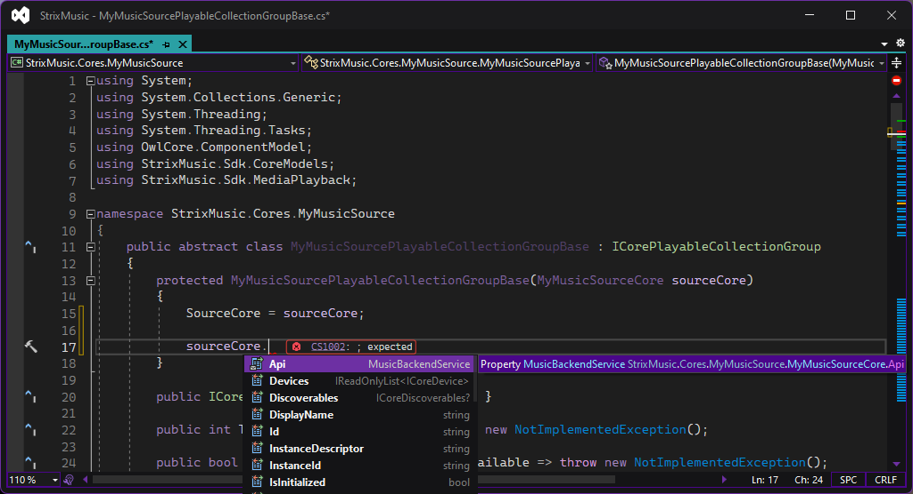
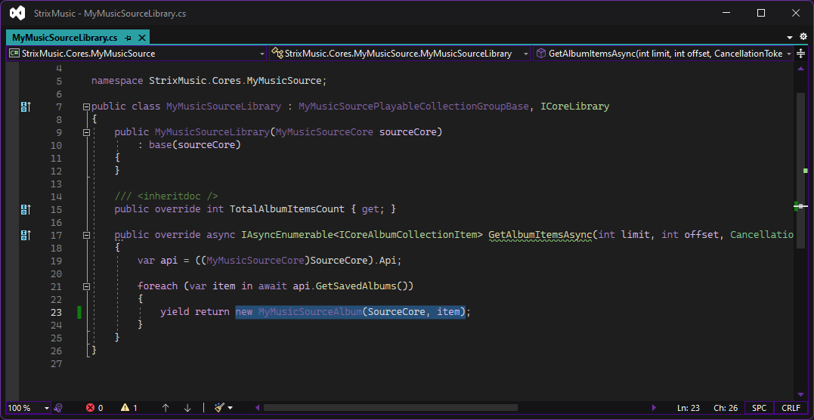

# Create a core
This tutorial will show you the basics on creating a core, and provide helpful advice for common pitfalls.

To follow current recommendations, these instructions are for creating a new core in Visual Studio in the [Strix Music repo](https://github.com/Arlodotexe/strix-music).

> [!WARNING] 
>
> Until we reach our golden release `1.0.0-sdk-stable`:
> - Breaking changes may be introduced as we address feedback from the community.
> - Comprehensive [changelogs](../reference/changelogs/) are included with every release.
> - We advise keeping development (e.g. creating cores) for the SDK in the [main repo](https://github.com/Arlodotexe/strix-music) so we can automatically migrate breaking changes for you.

> [!NOTE]
> #### Notes for core authors
> - Cores do not handle playback, unless the playback is done remotely on an external device. To enable playback, use a model plugin.
> 
> - Properties should be initialized before being returned or emitted. For example, if `TotalTracksCount` is zero, it'll appear as though there are no tracks to get, and some code may never try to get them.
> 
> - The SDK has built-in support for collection folders. Album, Artist and Playlist collections contain collection _items_, which are an interface inherited by both Album/Artist/Playlist, and AlbumCollection/ArtistCollection/PlaylistCollection. 

# Create a project

## New project

Start by opening the StrixMusic solution in Visual Studio.



Right click the "Cores" folder -> Add -> New Project


In the list of project templates, search for "Class Library" and select the C# class library capable of target .NET Standard.


Click "Next". Name the project `StrixMusic.Cores.MyMusicSource`, replacing `MyMusicSource` with your desired name.

Then, change the location to `.\src\Cores\` and click "Next".


Change the Framework to `.NET Standard 2.0` and click "Create".


You'll be greeted with an empty project and a starter class file. You can delete the default `Class1.cs` or repurpose it for your core in the next section.


## Enable nullables and C# 10
Open up the `.csproj` for your new core and add the following lines before the closing `</Project>`:

```xml
	<PropertyGroup>
		<Nullable>enable</Nullable>
		<LangVersion>12</LangVersion>
		<WarningsAsErrors>nullable</WarningsAsErrors>
	</PropertyGroup>
```

This tells the compiler to use C# 10, enable nullable reference types, and treat nullable warnings as errors.

> [!TIP]
> This is _highly_ recommended to help avoid `NullReferenceException`s at runtime.

## Add the SDK

Finally, add a reference to the Strix Music SDK to your project.

Right click the new project -> Add -> Project Reference.


Check the `StrixMusic.Sdk` box and click "OK".


# Set up your models.

All music services are different, therefore you should implement each CoreModel interface in a way that makes sense for _your_ backing API.

## Implement ICore

Start by creating a class called `MyMusicSourceCore` (again, replacing `MyMusicSource` with the desired name) and implement the interface [`ICore`](../reference/api/StrixMusic.Sdk.CoreModels.ICore.html):


### Replace implementation defaults
Visual Studio autofilled each property and method with `=> throw new NotImplementedException();`.

This is useful to track which things we haven't implemented yet, but bad if we actually want to _use_ this core.

Start by giving the methods at the bottom a proper body, instead of throwing:

```csharp
public ValueTask DisposeAsync()
{
    return default;
}

public Task<ICoreModel?> GetContextByIdAsync(string id, CancellationToken cancellationToken = default)
{
    return Task.FromResult<ICoreModel?>(null);
}

public Task<IMediaSourceConfig?> GetMediaSourceAsync(ICoreTrack track, CancellationToken cancellationToken = default)
{
    return Task.FromResult<IMediaSourceConfig?>(null);
}

public Task InitAsync(CancellationToken cancellationToken = default)
{
    return Task.CompletedTask;
}
```

Then fix properties by doing a replace all, trading `=> throw new NotImplementedException();` for `{ get; private set; }`. The end result should look a bit like this:


### Constructors and dependencies

> [!NOTE]
> Any dependencies required for your core to function should be exposed in the constructor.

The constructor for a core should be _very_ lightweight, only doing enough to satisfy dependencies and non-nullable properties.

Cores should also always be multi-instantiable, using the [`InstanceId`](../reference/api/StrixMusic.Sdk.CoreModels.ICore.html#StrixMusic_Sdk_CoreModels_ICore_InstanceId) to identify each instance.

Start by assigning all the non-nullable properties. Replace the values with your own as needed. `Library` is required to be assigned in the constructor, but we haven't implemented it yet. Leave it out for now, and circle back to instantiate it once implemented.  


Next, pass any data needed for your core to function into the constructor.

For our example, we'll take an `apiKey` string:


Then, we'll set up a `MusicBackendService` for this example to retrieve our data.

Your core will use something else to retrieve data - an API instance, a database context, whatever is needed.


## Implement the library
> [!WARNING]
> Library, RecentlyPlayed, Discoverables, etc., are all an [`ICorePlayableCollectionGroup`](../reference/api/StrixMusic.Sdk.CoreModels.ICorePlayableCollectionGroup.html). This interface is a combination of most collection types (album, artist, track, playlist, image).
> <br/> <br/>
> It's recommended to create an abstract base class with virtual, overrideable members to reduce the work needed to implement these. 

### Implement a base class

We'll be following the above advice, and creating a `MyMusicSourcePlayableCollectionGroupBase`.


All core implementations are required to have a `SourceCore` property which points to the `ICore` instance that created it. This should be trickled down via constructors:


This also allows us to access our already configured backend service, ready to use:



For now, we'll only focus on albums, so that's all we're going to set up. You can implement the rest outside of this tutorial.

Search the document for "AlbumItems", and make each member you find `virtual`. Close this file for now.

### Implement ICoreLibrary

Create a new class called `MyMusicSourceLibrary`. Inherit from `ICoreLibrary` and the new `MyMusicSourcePlayableCollectionGroupBase`:


Then, we can override the `GetAlbumItemsAsync` method and use our API to return albums in the user's library:


You'll notice there's still an error. That's because we're trying to return our API's `Album` type, when we need to return a CoreModel.

### Implement item CoreModels

To solve this, let's implement `ICoreAlbum` and use our API's `Album` type to power it.

Our backend service also has a method to get an album's tracks, so we can put some skeleton code in place for that while we're at it.


Now, we can return to our Library and finish implementing getting albums:



Great! There's just one more issue to solve.

## Initializing properties
Properties should _always_ be initialized before being returned or emitted outside the core.

For example, if `TotalTracksCount` is zero, it'll appear as though there are no tracks to get, and some code may never try to get them.

Some APIs, especially "pagination" style APIs, don't supply this information until you try getting some items.

The example we've provided so far suffers from this problem for demonstration purposes: our backend API doesn't tell us how many items there are, it just allows us to get them.

To remedy this, you'll need to get this information asynchronously while iterating through the parent collection.

To fix this for our `Album`s in the Library:

```csharp
public class MyMusicSourceLibrary : MyMusicSourcePlayableCollectionGroupBase, ICoreLibrary
{
    public MyMusicSourceLibrary(ICore sourceCore)
        : base(sourceCore)
    {
    }

    public override int TotalAlbumItemsCount { get; }

    public override async IAsyncEnumerable<ICoreAlbumCollectionItem> GetAlbumItemsAsync(int limit, int offset, CancellationToken cancellationToken = default)
    {
        var api = ((MyMusicSourceCore)SourceCore).Api;

        // TODO: handle limit and offset
        foreach(var item in await api.GetSavedAlbums())
        {
            var tracks = await api.GetAlbumTracks(item.Id);

            yield return new MyMusicSourceAlbum(SourceCore, item)
            {
                TotalTrackCount = tracks.Count(),
            };
        }
    }
}
```

This has the obvious drawback of increasing the time it takes to get each album, The performance impact of this is partially mitigated by `IAsyncEnumerable`, and can further mitigating using a caching strategy in your core.

# Finish implementing the core
There are 6 types of collections:
- `ICoreImageCollection`
- `ICoreAlbumCollection`
- `ICoreArtistCollection` 
- `ICorePlaylistCollection`
- `ICoreTrackCollection`
- `ICorePlayableCollectionGroup`

Each of the models (Album, Artist, Track, Playlist, Search, Library, etc) support some combination of these interfaces.

For example, an `ICoreTrack` is an image collection and artist collection.

`ICorePlayableCollectionGroup`, used by library, search, recently played, etc., implements _all_ of these collection types.

You're now equipped with the blueprints you need to implement any of these collections.

# Initializing the core
Before your core can be used, consumers are required to call `InitAsync` on your core.

This is your opportunity to perform any async setup needed before usage, such as login, database init, user configuration, etc.
