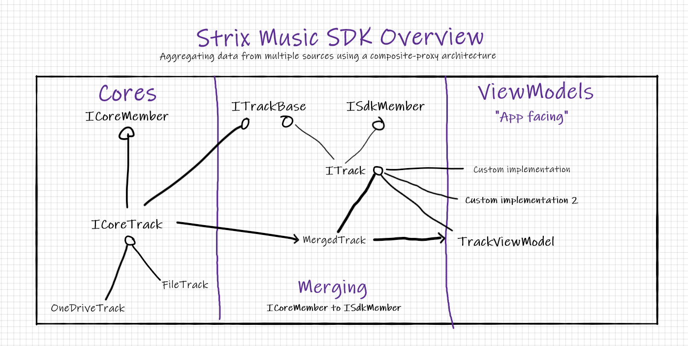

<h2 style="text-align: center;">
 The universal music development kit
</h2>

A highly flexible and standardized development kit for music apps.

Rapidly interface with any music service to build new apps and tools. 

## High level overview

> [!WARNING]
>
> ###### **This SDK is still in alpha**. 
> - Core interfaces are safe to build with and are unlikely to change.
> - Implementation of app-facing content may be incomplete.
> - Building fully custom apps on top of the SDK is inadvisable until the 1.0.0 release.
> - Until the SDK is finished, we advise keeping development for the SDK in the [main repo](https://github.com/Arlodotexe/strix-music). 

The Strix SDK is split into 3 parts:

1. [Cores](./cores) - A common API surface that can be implemented to allow interfacing with an arbitrary music provider.
2. [Merged](./api/StrixMusic.Sdk.Models.Merged.html) - Aggregates data from multiples core sources, merging items as needed.
3. [ViewModels and Shells](./shells) - Handles INPC from a merged source, delegates local playback and more.

For a deeper dive into the architecture, see the [SDK API](./api/) docs.

Aggregating data from multiple music sources using a composite-proxy architecture

<!-- Example for embedding code directly in docs.  -->
<!-- [!code[Main](../src/Sdk/StrixMusic.Sdk/Plugins/CoreRemote/RemoteCore.cs#L43-L103)] -->
