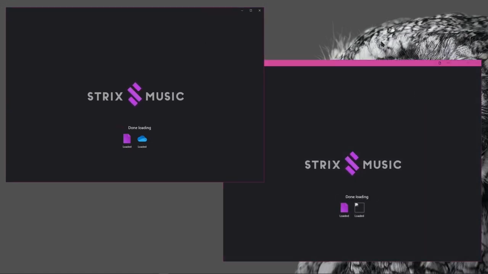

# Strix Music SDK

---

- Highly flexible and standardized.

- Quickly interface with any music service.

- Rapidly build new music apps and tools.

- Expand existing strix-compatible apps with new sources, skins and functionality.

---

> [!WARNING]
>
> ###### **This SDK is still in alpha**. 
> - Core interfaces are unlikely to change and are safe to build with.
> - Implementation of app-facing content may be incomplete.
> - The finished SDK will be released on Nuget when the public beta launches.
<!-- 

--- -->

## High level overview

The Strix SDK is split into 3 parts:

1. [Cores](./cores) - A common API surface that can be implemented to allow interfacing with an arbitrary music provider.
2. [Merged](./api/StrixMusic.Sdk.Models.Merged.html) - Aggregates data from multiples core sources, merging items as needed.
3. [ViewModels and Shells](./shells) - Handles INPC from a merged source, delegates local playback and more.

For a deeper dive into the architecture, see the [SDK API](./api/) docs.

Aggregating data from multiple music sources using a composite-proxy architecture

<!-- Example for embedding code directly in docs.  -->
<!-- [!code[Main](../src/Sdk/StrixMusic.Sdk/Plugins/CoreRemote/RemoteCore.cs#L43-L103)] -->
